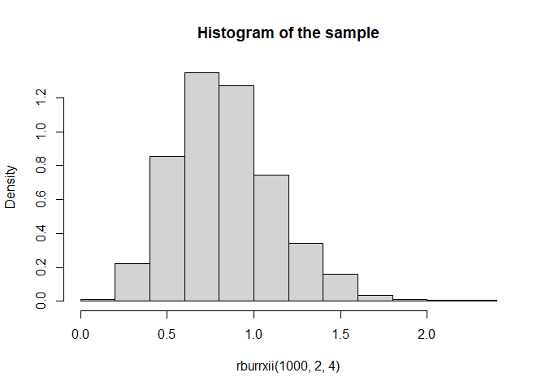
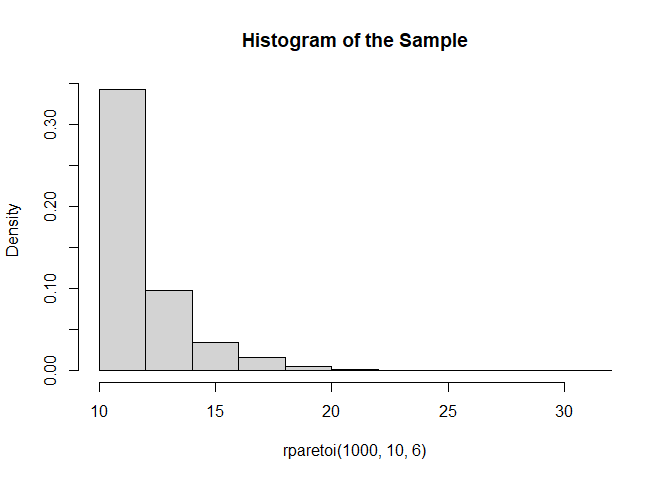

<!-- README.md is generated from README.Rmd. Please edit that file -->

# Package `genrs` <a href="https://wyaravms.github.io/genrs/"></a>

<!-- badges: start -->

[](https://github.com/wyaravms/genrs/actions/workflows/R-CMD-check.yaml)
[](Redirect-URL)
[-blue.svg)](https://github.com/wyaravms/genrs/blob/main/LICENSE.md)

<!-- badges: end -->

Important Note: This package is just an example that I used to study how
to create a package and add some elements to the documentation.

Functions that enable the generation of random samples from various
distribution functions. The method used to generate these values was
implemented using the Inverse Transform Sampling method.

## Installation

You can install the development version of genrs from
[GitHub](https://github.com/) with:

``` r
# install.packages("devtools")
devtools::install_github("wyaravms/genrs")
```

## Example

These are some basic examples using the functions available in the
`genrs` package:

``` r
library(genrs)
```

Function `rburrxii` generates random data following a Burr XII
distribution with parameters shape1 and shape2.

``` r
rburrxii(10, 2, 3)
#>  [1] 0.3916599 0.3302186 0.9729286 1.0382671 0.8249860 0.6858643 0.4202429
#>  [8] 1.4767603 0.7075502 0.5496158
```

``` r
hist(rburrxii(1000, 2, 4), freq = FALSE, main = "Histogram of the sample")
```



Function `rparetoi` generates random data following a Pareto I
distribution with parameters scale and shape.

``` r
rparetoi(10, 3, 6)
#>  [1] 3.350480 3.190786 3.347261 4.109502 3.569522 5.683499 3.608258 3.169733
#>  [9] 3.587065 3.523597
```

``` r
hist(rparetoi(1000, 10, 6), freq = FALSE, main = "Histogram of the sample")
```


