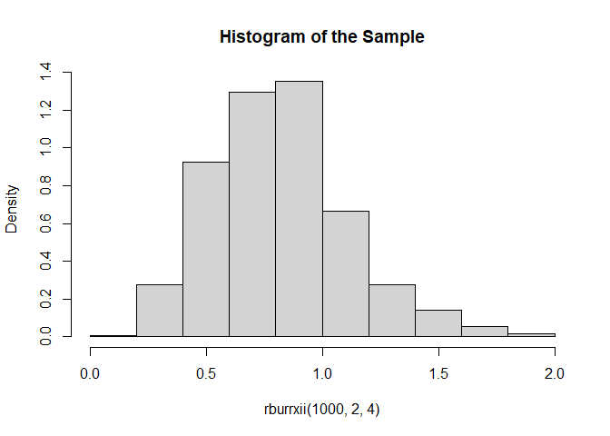

<!-- README.md is generated from README.Rmd. Please edit that file -->

# Package `genrs` <a href="https://wyaravms.github.io/genrs/"></a>

<!-- badges: start -->

[](https://github.com/wyaravms/genrs/actions/workflows/R-CMD-check.yaml)
[](Redirect-URL)
[-blue.svg)](https://github.com/wyaravms/genrs/blob/main/LICENSE.md)

<!-- badges: end -->

Important Note: This package is just an example that I used to study how
to create a package and add some elements to the documentation.

In this package, you will find functions that enable the generation of
random samples from various distribution functions. The method used to
generate these values was implemented using the Inverse Transform
Sampling method.

## Installation

You can install the development version of genrs from
[GitHub](https://github.com/) with:

``` r
# install.packages("devtools")
devtools::install_github("wyaravms/genrs")
```

## Example

These are some basic examples using the functions available in the
`genrs` package:

``` r
library(genrs)
```

Function `rburrxii` generates random data following a Burr XII
distribution with parameters shape1 and shape2.

``` r
rburrxii(10, 2, 3)
#>  [1] 0.6622819 1.1151069 0.7463375 1.0880695 0.7364627 0.9581563 0.7460538
#>  [8] 0.6528588 1.2624069 0.8462232
```

``` r
hist(rburrxii(1000, 2, 4), freq = FALSE, main = "Histogram of the Sample")
```



Function `rparetoi` generates random data following a Pareto I
distribution with parameters scale and shape.

``` r
rparetoi(10, 3, 6)
#>  [1] 3.258682 3.191228 3.261140 3.466575 3.885335 3.042769 3.402817 3.997748
#>  [9] 5.074505 3.833168
```

``` r
hist(rparetoi(1000, 10, 6), freq = FALSE, main = "Histogram of the Sample")
```


Function `rloglogis` generates random data following a Log-logistic
distribution with parameters scale and shape.

``` r
rloglogis(10, 3, 6)
#>  [1] 2.943345 4.522133 3.289996 1.985151 3.761592 2.312687 3.602403 3.412819
#>  [9] 3.064508 3.263536
```

``` r
hist(rloglogis(1000, 1, 8), freq = FALSE, main = "Histogram of the Sample")
```


